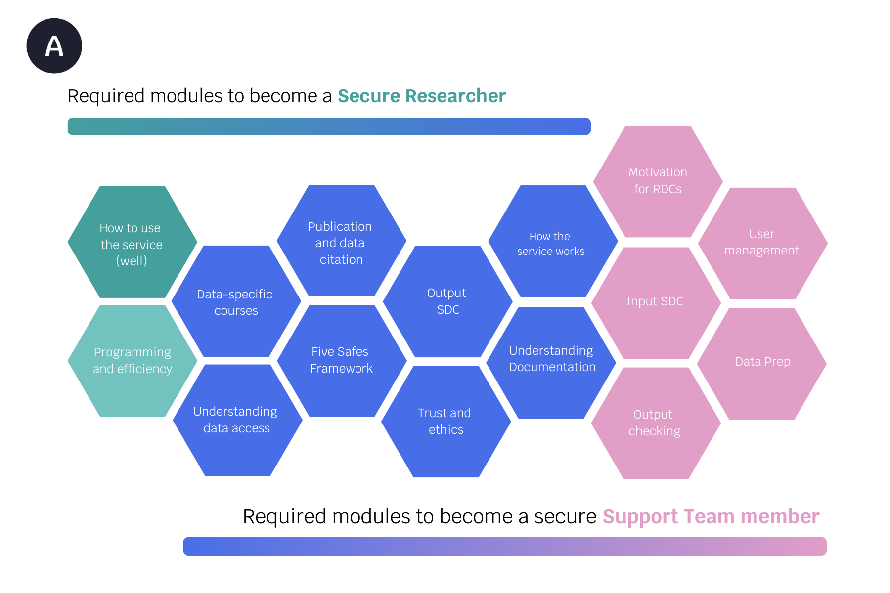

+++
title = "Training"
weight = 1

[extra]
header_image = "images/rcodeangelhoriz.jpg"
+++

# ASSURED Modules 


ASSURED training is based on a flexible, modular approach catering to the differing needs of those involved in the wide landscape of research data.


Our **Core Modules** cover the key knowledge that is indispensable to work with any sensitive data safely across research disciplines. These modules include topics such as data citation, lawful data sharing, understanding data access, and how to produce non-disclosive research outputs which are essential to achieve the Safe Use of research data in accordance with the Five Safes Framework.

**Specialised Modules** provide skills that are necessary for specific applications, such as:
1. conducting research in a particular secure environment like GESIS Safe Haven
2. utilising different data types such as genetic data, medical data, or qualitative data
3. in a particular role such as a researcher, data access professional, or data producer. 

 

All ASSURED modules are conveyed via short (about 10 minutes) and compact learning units. The programme also includes interactive activities and assessments to test understanding. This modular structure enables Research Data Centres and trainees to create individual learning pathways for their researchers and professional staff by combining the Core Modules with those Specialised Modules that best suit their requirements for accessing data or their professional development ambitions.

Upon completion of the Core Modules, those trained by ASSURED will be awarded a standardised and widely-recognised accreditation and the skills to work safely with sensitive research data.

The modules are currently in development. To get an idea of how the contents will look like, we invite you watch the video on the Five Safes Framework:

{{ youtube(embed_code="8D8ib1EWKYw?si=3pajcGp-JOlRLdCQ") }}
